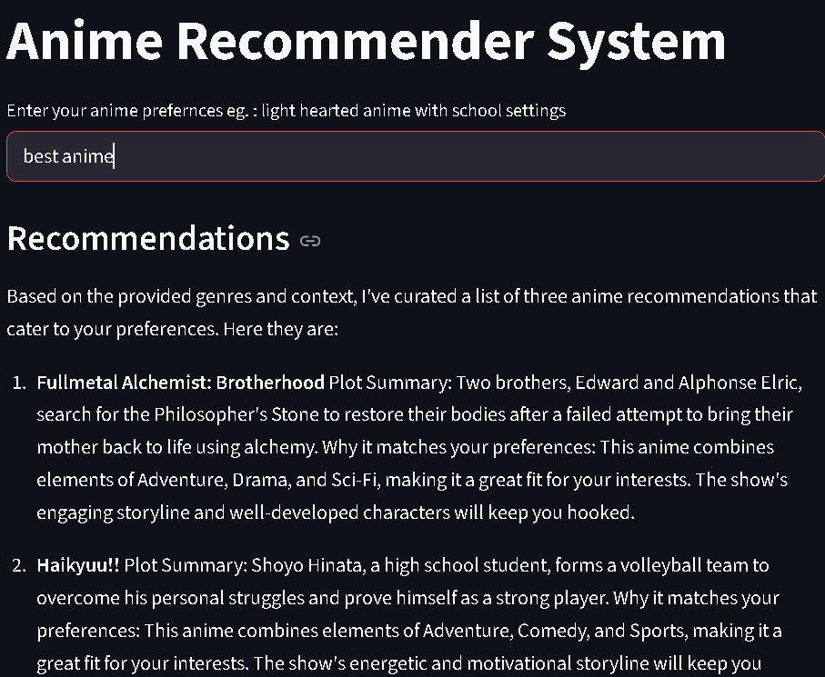
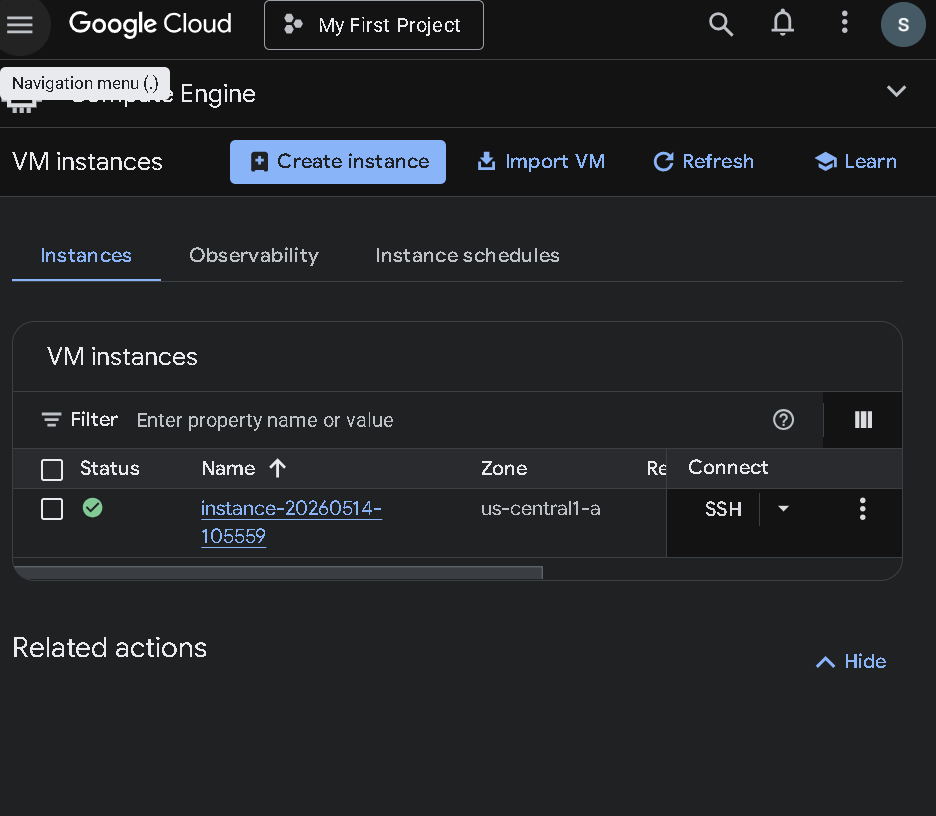
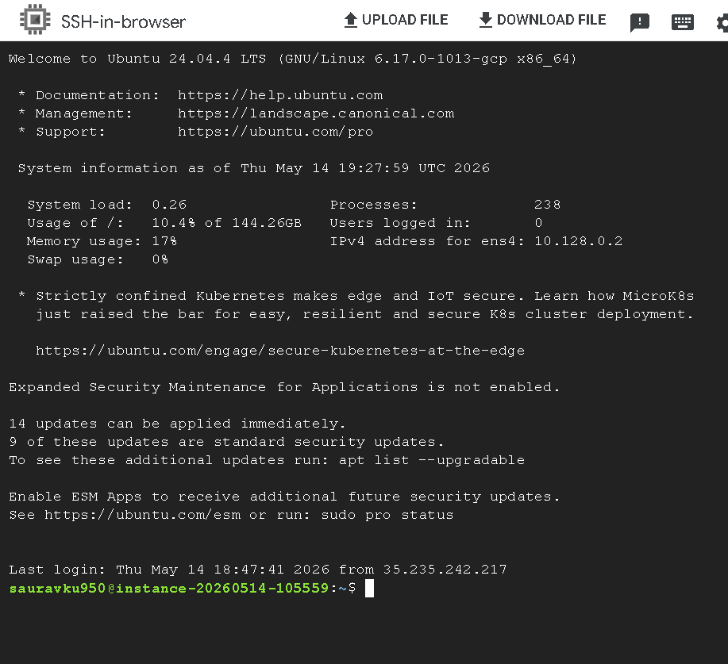
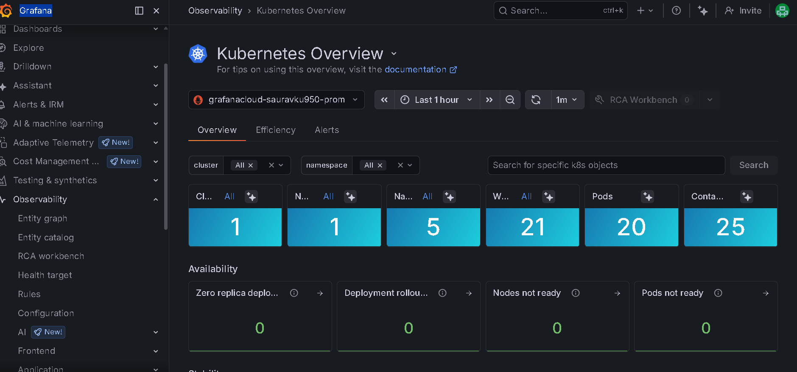

# 🤖 Anime Recommender — LLMOps on Kubernetes

A Streamlit-based anime recommendation app powered by LangChain + Groq, fully containerized with Docker and deployed on a Kubernetes cluster (Minikube) inside a Google Cloud VM — with Grafana Cloud monitoring.

---

## 📁 Project Structure

```
.
├── app/
│   └── app.py                    # Streamlit UI — takes user query, returns recommendations
├── pipeline/
│   ├── __init__.py
│   └── pipeline.py               # AnimeRecommendationPipeline — loads vector store & runs recommender
├── src/
│   ├── data_loader.py            # Loads & merges anime CSVs
│   ├── vector_store.py           # Builds / loads ChromaDB vector store
│   └── recommender.py            # AnimeRecommender — RAG chain using Groq LLM
├── config/
│   └── config.py                 # Centralised config (API keys, model name)
├── utils/
│   ├── logger.py                 # Shared logger
│   └── custom_exception.py       # Custom exception wrapper
├── data/
│   ├── anime_with_synopsis.csv   # Raw anime + synopsis data
│   └── anime_updated.csv         # Updated anime metadata
├── chroma_db/                    # Persisted ChromaDB vector store (auto-generated)
├── build_pipeline.py             # One-time script: load data → build & save vector store
├── Dockerfile                    # Container definition
├── llmops-k8s.yaml               # Kubernetes Deployment + Service manifest
├── requirements.txt              # Python dependencies
├── setup.py                      # Package setup
├── .env                          # API keys (never commit this)
└── .gitignore
```

---

## ⚙️ Tech Stack

| Layer | Tool |
|---|---|
| Frontend | Streamlit |
| LLM Backend | Groq (via LangChain) |
| Embeddings | HuggingFace Sentence Transformers |
| Vector Store | ChromaDB |
| Containerization | Docker |
| Orchestration | Kubernetes (Minikube) |
| Cloud VM | Google Cloud (Ubuntu 24.04) |
| Monitoring | Grafana Cloud + Helm |

---

## 🧠 How It Works

```
User Query (Streamlit)
        │
        ▼
AnimeRecommendationPipeline  (pipeline/pipeline.py)
        │
        ├── Loads persisted ChromaDB vector store
        ├── Creates a retriever from the vector store
        │
        ▼
AnimeRecommender  (src/recommender.py)
        │
        ├── Retrieves top-k relevant anime documents
        ├── Passes them + the user query to Groq LLM
        │
        ▼
    LLM Response → Streamlit UI
```

### App Preview


> Enter a preference like *"best anime"* and get curated recommendations with plot summaries and genre reasoning.

### First-time Setup — Build the Vector Store

Before running the app for the first time, you must build the ChromaDB vector store from the raw CSV data:

```bash
python build_pipeline.py
```

This will:
1. Load and merge `data/anime_with_synopsis.csv` and `data/anime_updated.csv`
2. Chunk and embed the data using HuggingFace Sentence Transformers
3. Persist the vector store to the `chroma_db/` directory

> ✅ You only need to run this **once**. The app loads from the saved `chroma_db/` on every subsequent start.


Create a `.env` file in the project root (see `.env.example`):

```env
GROQ_API_KEY=your_groq_api_key
HUGGINGFACEHUB_API_TOKEN=your_huggingface_token
```

> ⚠️ Never commit your real `.env` file. It is listed in `.gitignore`.

---

## 💻 Running Locally (without Kubernetes)

```bash
# 1. Clone the repo
git clone https://github.com/data-guru0/TESTING-9.git
cd TESTING-9

# 2. Install dependencies
pip install -e .

# 3. Add your API keys to .env
cp .env.example .env   # then fill in your keys

# 4. Build the vector store (first time only)
python build_pipeline.py

# 5. Launch the app
streamlit run app/app.py
```

---

## 🚀 Deployment Guide

### 1. Push Code to GitHub

```bash
git add .
git commit -m "initial commit"
git push origin main
```

---

### 2. Create a Google Cloud VM

1. Go to **VM Instances** → **Create Instance**
2. Configure:
   - **Machine type:** E2 Standard — 16 GB RAM
   - **Boot disk:** 256 GB, Ubuntu 24.04 LTS
   - **Networking:** Enable HTTP and HTTPS traffic
3. Click **Create**, then connect via the browser SSH button.



---

### 3. Set Up the VM

**Clone the repo:**
```bash
git clone https://github.com/data-guru0/TESTING-9.git
cd TESTING-9
```

**Install Docker** (follow [docs.docker.com](https://docs.docker.com/engine/install/ubuntu/)):
```bash
# Paste the official install command blocks, then verify:
docker run hello-world
```

**Run Docker without sudo:**
```bash
# Follow "Post-installation steps for Linux" on the Docker docs page
# (4 commands — the last one is a test)
```

**Enable Docker on boot:**
```bash
sudo systemctl enable docker.service
sudo systemctl enable containerd.service
```

**Verify:**
```bash
systemctl status docker   # Should show: active (running)
docker ps                 # No containers running yet
```


> Ubuntu 24.04 LTS VM connected via browser SSH — ready for Docker and Minikube setup.

---

### 4. Install Minikube & kubectl

**Minikube** ([minikube.sigs.k8s.io](https://minikube.sigs.k8s.io/docs/start/)):
```bash
# Choose: OS = Linux, Architecture = x86, Binary download
# Paste the installation commands from the official site, then:
minikube start
```

**kubectl:**
```bash
sudo snap install kubectl --classic
kubectl version --client
```

**Verify cluster:**
```bash
minikube status       # All components should be running
kubectl get nodes     # Should show the minikube node
kubectl cluster-info
docker ps             # Minikube container should be listed
```

---

### 5. Configure Git on VM

```bash
git config --global user.email "your@email.com"
git config --global user.name "your-github-username"
```

When pushing, use your **GitHub personal access token** as the password (it won't be visible when typed).

---

### 6. Build & Deploy the App

**Point Docker to Minikube's registry:**
```bash
eval $(minikube docker-env)
```

**Build the Docker image:**
```bash
docker build -t llmops-app:latest .
```

**Create the Kubernetes secret with your API keys:**
```bash
kubectl create secret generic llmops-secrets \
  --from-literal=GROQ_API_KEY="your_groq_api_key" \
  --from-literal=HUGGINGFACEHUB_API_TOKEN="your_huggingface_token"
```

**Apply the Kubernetes manifest:**
```bash
kubectl apply -f llmops-k8s.yaml
kubectl get pods    # Wait until STATUS = Running
```

---

### 7. Access the App

Open **two separate terminals** on the VM:

**Terminal 1 — Start the tunnel:**
```bash
minikube tunnel
```

**Terminal 2 — Forward the port:**
```bash
kubectl port-forward svc/llmops-service 8501:80 --address 0.0.0.0
```

Then open your browser at: `http://<vm-external-ip>:8501`

---

## 📊 Grafana Cloud Monitoring

### Set Up the Monitoring Namespace
```bash
kubectl create ns monitoring
kubectl get ns
```

### Install Helm
Search "Install Helm" and copy the 3 commands from the **script** section of the official site.

### Connect to Grafana Cloud

1. Log in to [Grafana Cloud](https://grafana.com/auth/sign-in)
2. Go to **Observability → Kubernetes → Start Sending Data**
3. Under **Backend Installation**, click **Install**
4. Fill in:
   - Cluster name: `minikube`
   - Namespace: `monitoring`
5. Select **Kubernetes**, keep other defaults
6. Create a new access token (e.g. `minikube-token`) and save it securely
7. Select **Helm** — a `helm upgrade` command will be generated

### Deploy the Helm Chart

Create a `values.yaml` file on the VM:
```bash
vi values.yaml
# Paste everything from the Grafana-generated config
# Remove the opening `helm repo add ... <<'EOF'` line and the closing `EOF`
# Save with: Esc → :wq!
```

Run the modified command (using `--values values.yaml` instead of `<<'EOF'`):
```bash
helm repo add grafana https://grafana.github.io/helm-charts && \
helm repo update && \
helm upgrade --install --atomic --timeout 300s grafana-k8s-monitoring grafana/k8s-monitoring \
  --namespace "monitoring" --create-namespace --values values.yaml
```

**Verify pods are running:**
```bash
kubectl get pods -n monitoring
```

Go back to Grafana Cloud → click **Go to Homepage** → refresh the page.
You should now see live metrics from your Kubernetes cluster. 🎉


> Live Kubernetes Overview in Grafana Cloud — 1 cluster, 5 namespaces, 20 pods, 25 containers, all healthy with zero availability issues.

---

## 📦 Dependencies

See [`requirements.txt`](requirements.txt):

- `langchain`, `langchain-community`, `langchain_groq`
- `chromadb`
- `streamlit`
- `pandas`, `python-dotenv`
- `sentence-transformers`, `langchain_huggingface`
- `langchain-text-splitters`

---

## 🖼️ Screenshots

| App UI | GCP VM | SSH Terminal | Grafana Dashboard |
|---|---|---|---|
|  |  |  |  |

> **To add these screenshots to your repo:** create a `screenshots/` folder in the project root and save the images as:
> - `screenshots/app-ui.png`
> - `screenshots/gcp-vm.png`
> - `screenshots/ssh-terminal.png`
> - `screenshots/grafana-dashboard.png`

---

## 👤 Author

**Saurav** — [data-guru0](https://github.com/data-guru0)
